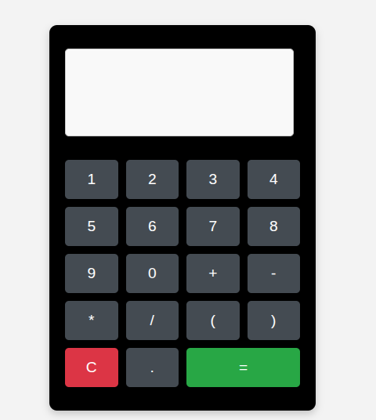

# 🧮 Calculadora Básica en JavaScript

En este proyecto aprenderás a crear una **calculadora funcional** que permite realizar operaciones matemáticas simples como **suma**, **resta**, **multiplicación** y **división**. Es una excelente introducción para quienes están comenzando a usar HTML, CSS y JavaScript de manera integrada.

---
## ✨ Funcionalidades

- Soporte para las 4 operaciones básicas.
- Entrada desde teclado o clics en botones.
- Soporte para paréntesis y decimales.
- Detección de errores de sintaxis (paréntesis no balanceados).
- Evaluación de expresiones con `eval()` (uso educativo).
- Scroll automático en el input si hay contenido extenso.
- Tecla `C` o `Escape` para borrar toda la operación.
- Tecla `Enter` o `=` para mostrar el resultado.

---
## 🛠 Tecnologías Utilizadas

- **HTML** 📝: Define la estructura y los elementos de la calculadora.
- **CSS** 🎨: Da estilo a la interfaz de usuario para hacerla visualmente atractiva.
- **JavaScript** ⚙️: Aplica la lógica necesaria para que la calculadora funcione de forma interactiva y dinámica.

---

## 👨‍🎓 Público objetivo

Este proyecto está dirigido a:

- Principiantes que desean mejorar su lógica de programación.
- Estudiantes que están aprendiendo DOM, eventos y manipulación de inputs.
- Desarrolladores que quieren practicar buenas prácticas con JavaScript puro.

---

## 📦 Requisitos previos

Antes de comenzar, asegúrate de tener instalado lo siguiente:

- Un editor de código, como [Visual Studio Code](https://code.visualstudio.com/)
- Un navegador web moderno (Google Chrome, Firefox, Edge, etc.)
- Conocimientos básicos sobre:
  - Estructura HTML
  - Selectores y estilos CSS
  - Eventos y funciones en JavaScript

---

## 📸  Vista Previa

